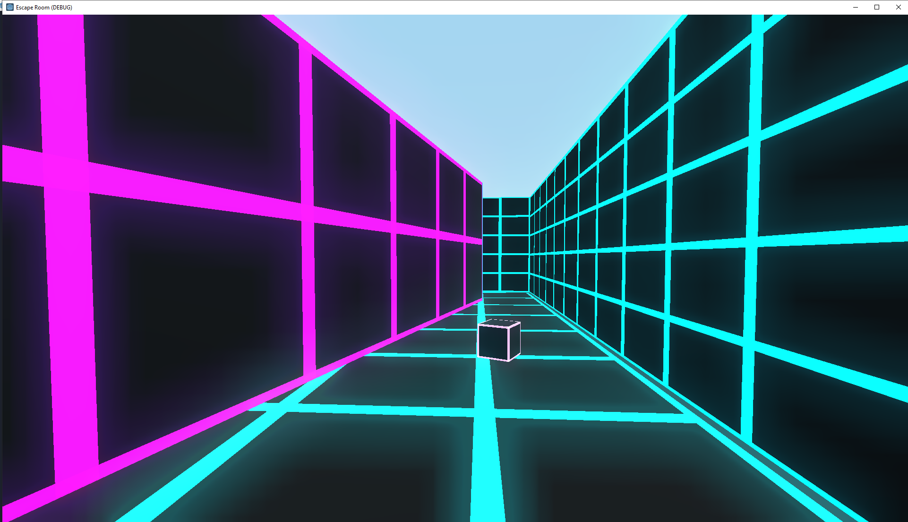

Godot C# 3D - Escape Room
-------------------------

Overview
========

This is an example project to go along with the [Youtube Tutorial](https://www.youtube.com/playlist?list=PLFsjUWfnATIn0Q363vn_0ewlVJII0fETe) I made to show a simple 3D game in Godot.

All code is written in C#

The following resources have had a heavy impact on this project:
1. [Official FPS tutorial](https://docs.godotengine.org/en/stable/tutorials/3d/fps_tutorial/part_one.html)
1. [My simple interaction example](https://github.com/MitchReidNZ/Godot-Interaction-Example)

If you have any questions or need help adding this to your own projects you can contact me through the youtube comments or by opening an issue on this repository.

Art Assets
==========
This project is currently only using built-in primitives!

The tron-inspired shader is explained in one of the youtube videos if you're interested.