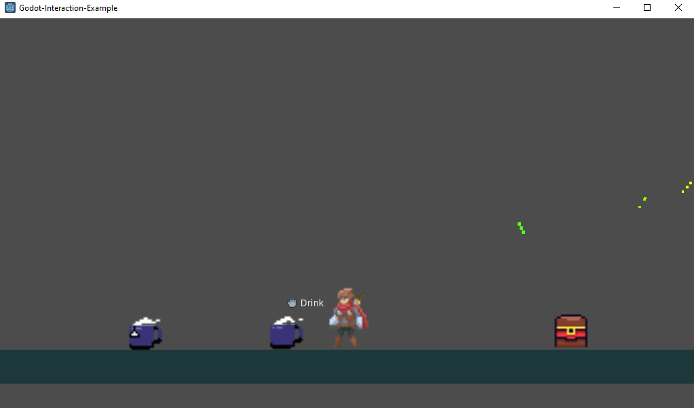

Godot Interaction Example
-------------------------

Overview
========

This is an example project to go along with the [Youtube Tutorial](https://youtu.be/C_-faOyIuTQ) I made to show a simple interaction system for Godot.

All code is written in GDScript, and built to decouple the UI from the interaction system itself. The youtube video linked above has a project overview, so I'd recommend starting with that.

Hopefully this can be introduced into any existing projects with minimal changes. Feel free to copy and modify this for your own projects.

If you have any questions or need help adding this to your own projects you can contact me through the youtube comments or by opening an issue on this repository.

Art Assets
==========
The character is the awesome [Animated Pixel Hero](https://rvros.itch.io/animated-pixel-hero) made by [rvros](https://rvros.itch.io/) on itch.

The coffee/tea mugs and the chest were created by me. Feel free to use them in your own projects.